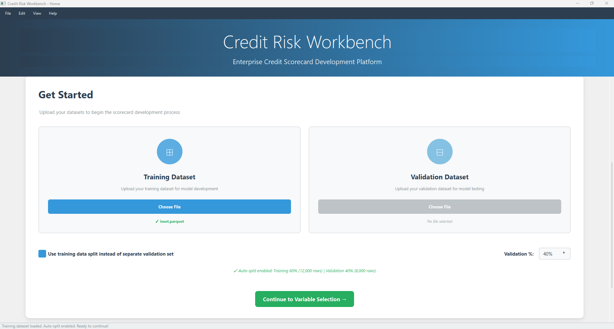
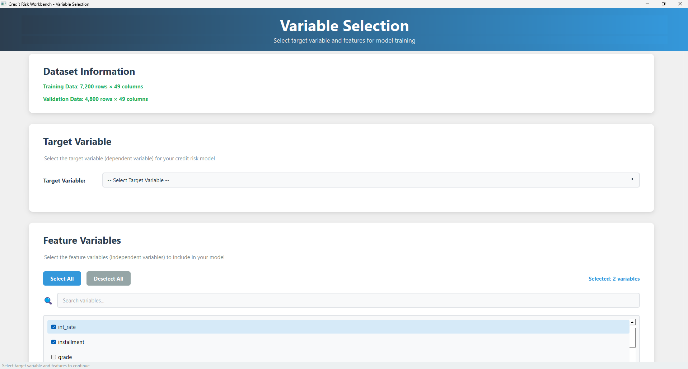
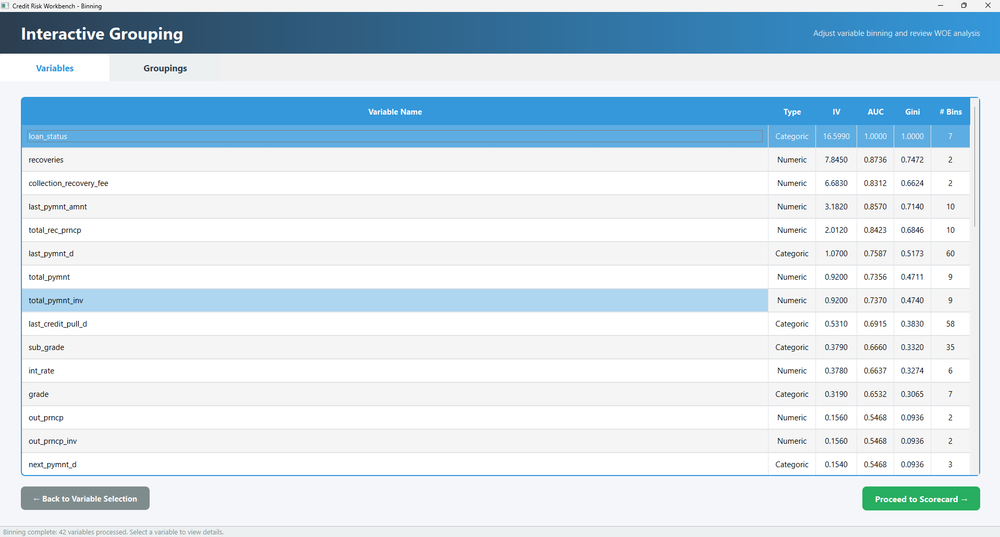
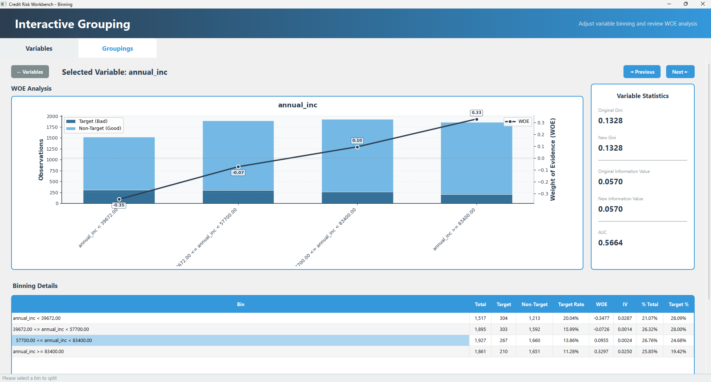
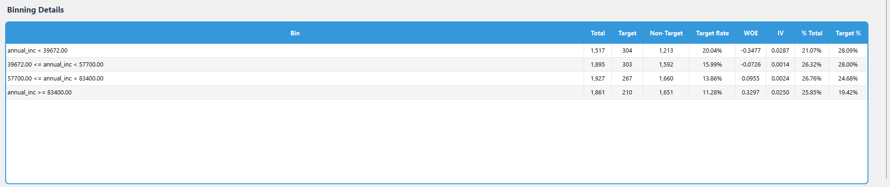
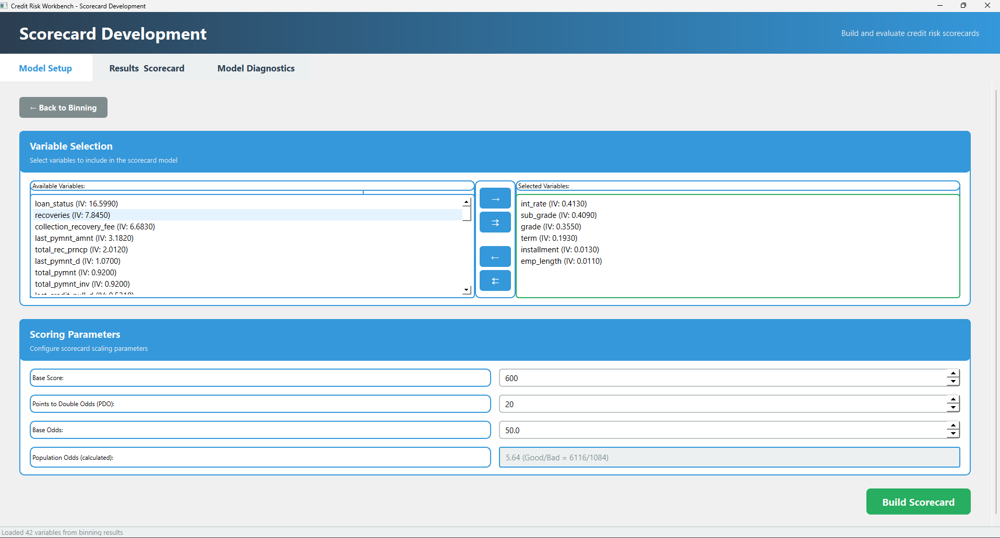
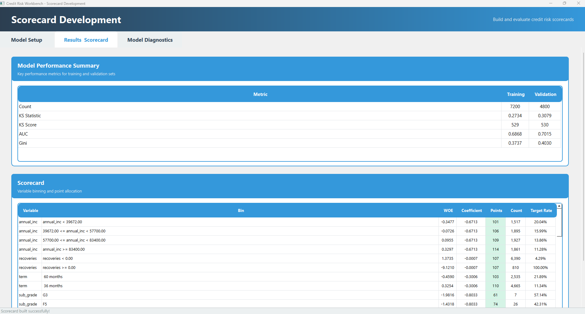
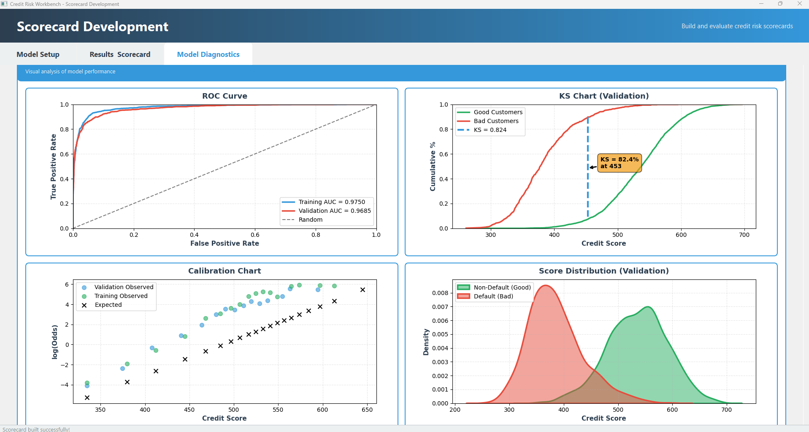

# Credit Risk Workbench

## Overview

**Credit Risk Workbench** is a desktop-based analytical application designed to support the **end-to-end development of traditional credit risk scorecards**. It provides a structured, transparent, and practitioner-focused workflow for building, analyzing, and exporting credit risk models commonly used in banking and financial institutions.

The application emphasizes **interpretability, statistical rigor, and regulatory transparency**, aligning with industry-standard scorecard development methodologies rather than black-box modeling approaches.

---

## Application Purpose

The primary objective of Credit Risk Workbench is to provide credit risk practitioners with a **controlled and explainable environment** for:

- Developing scorecards using established statistical techniques  
- Inspecting and refining binning logic  
- Evaluating variable-level and model-level performance  
- Exporting modeling artifacts for validation, governance, and system integration  

---

## Core Features

### 1. Data Ingestion

- Load separate **training** and **validation** datasets  
- Automatic validation of dataset structure and consistency  
- Enforces binary target definition:
  - `0` → Non-target  
  - `1` → Target  
- Displays dataset dimensions and class distribution  

**Screenshot — Data Ingestion Screen**  


---

### 2. Variable Selection

- Interactive variable selection interface  
- Search, filter, and bulk selection capabilities  
- Clear distinction between target variable and predictors  
- Ensures consistency across training and validation datasets  

**Screenshot — Variable Selection Screen**  


---

### 3. Supervised Binning (WoE / IV)

- Supervised **Weight of Evidence (WoE)** and **Information Value (IV)** based binning  
- Enforces **monotonicity**, consistent with scorecard best practices  
- Supports both:
  - Numerical variables  
  - Categorical variables  
- Automated binning with practitioner oversight  

**Screenshot — Automatic Binning Screen**  


---

### 4. Manual Bin Adjustment

- Ability to **manually split and merge bins**  
- Supports expert-driven refinement of automated binning  
- Immediate recalculation of bin-level statistics  
- Persistent binning state to avoid unnecessary recomputation  

**Screenshot — Manual Binning Screen**  


---

### 5. Statistical Diagnostics

For each binned variable, the application computes and presents:

- Weight of Evidence (WoE)  
- Information Value (IV) 
- Area Under the Curve (AUC) 
- Gini coefficient    
- Target and non-target distributions per bin  

These diagnostics support:
- Variable selection decisions  
- Model explainability  
- Validation and governance requirements  

**Screenshot — Variable Statistics Screen**  


---

### 6. Scorecard Development

The Scorecard Development module is organized into three dedicated tabs, guiding the user through model setup, scorecard results, and model diagnostics.

---

#### 6.1 Model Setup

- User-driven **selection of variables** to be included in the final scorecard model from the set of successfully binned predictors  
- Explicit control over **scorecard scaling parameters**, including:
  - **Base Score**
  - **Points to Double the Odds (PDO)**
  - **Base Odds**
- Construction of a traditional **logistic regression–based credit scorecard** using Weight of Evidence (WoE)–transformed variables  
- Clear and auditable transformation pipeline:
  - Bins → Weight of Evidence (WoE)  
  - WoE → Logistic regression coefficients  
  - Coefficients → Scorecard points 



---

#### 6.2 Scorecard Results

This tab presents model performance and scorecard outputs for both **training** and **validation** datasets, including:

**Model Performance Metrics**
- Observation count for training and validation samples  
- Kolmogorov–Smirnov (KS) statistic  
- KS score  
- Area Under the ROC Curve (AUC)  
- Gini coefficient  

**Scorecard Output**
- Detailed scorecard table including:
  - Variable bin definitions  
  - Weight of Evidence values
  - Variable Coefficient  
  - Point allocation per bin
  - Bin Counts and Target rate  

**Export Capabilities**
- Export of the complete **scorecard summary as an Excel file**  
- Export of the trained model as:
  - **PMML** for system integration  
  - **JSON** containing detailed scorecard binning rules for transparency and reproducibility  



---

#### 6.3 Model Diagnostics

This tab provides statistical and visual diagnostics to support model validation and governance.

**Statistical Diagnostics**
- **Coefficient significance analysis**, including p-values for model coefficients  
- **Correlation matrix** of model coefficients to assess multicollinearity  

**Diagnostic Plots**
- AUC Curve
- KS Chart (validation dataset)  
- Calibration chart to assess **odds-to-score alignment**  
- Score distribution plots to evaluate separation and stability  

These diagnostics enable practitioners to evaluate model robustness, stability, and interpretability prior to deployment.



---

## Application Architecture

- **Frontend**: PyQt6 desktop GUI  
- **Design Pattern**: Controller-based modular architecture  
- **Backend**: Python-based statistical computation  
- **Packaging**: PyInstaller (Windows executable); Working on Linux and macOS support for future releases 

The architecture prioritizes **clarity, separation of concerns, and traceability**, reflecting real-world credit model development workflows.


---

## Running the Application

### Option 1: Run from Source (Developers)

```bash
python -m venv venv
venv\Scripts\activate
pip install -r requirements.txt
python app.py
```

### Option 2: Run Packaged Executable (Windows)
CreditRiskWorkbench.exe

## Technology Stack
 - Python 3.x
 - PyQt6
 - pandas
 - numpy
 - scikit-learn
 - matplotlib and seaborn
 - PyInstaller

## Intended Use & Scope
This application is designed for:
- Retail credit risk modeling
- Scorecard development and validation workflows
- Educational and research purposes
- Environments requiring model interpretability, auditability, and regulatory transparency

The Credit Risk Workbench focuses on traditional, interpretable scorecard modeling techniques and does not aim to replace enterprise-wide model governance or production scoring platforms.

## References Texts
- Siddiqi, N. (2012). Intelligent Credit Scoring: Building and Implementing Better Credit Risk Scorecards. Wiley & SAS Business Series.